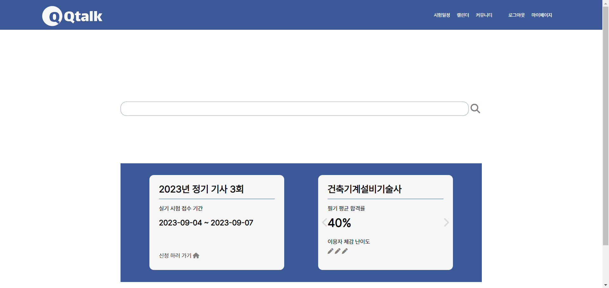
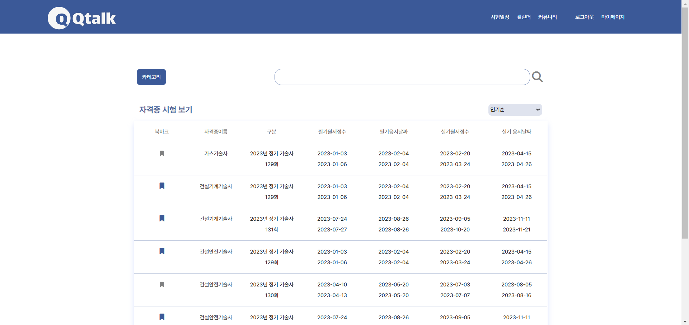
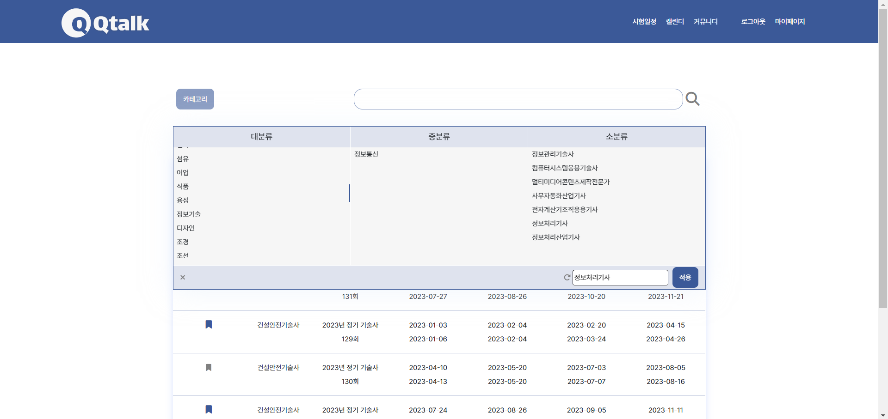
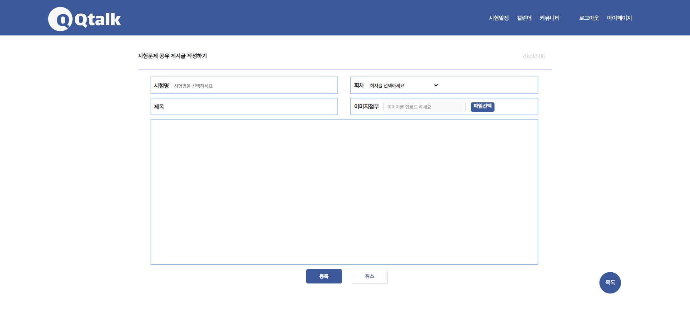
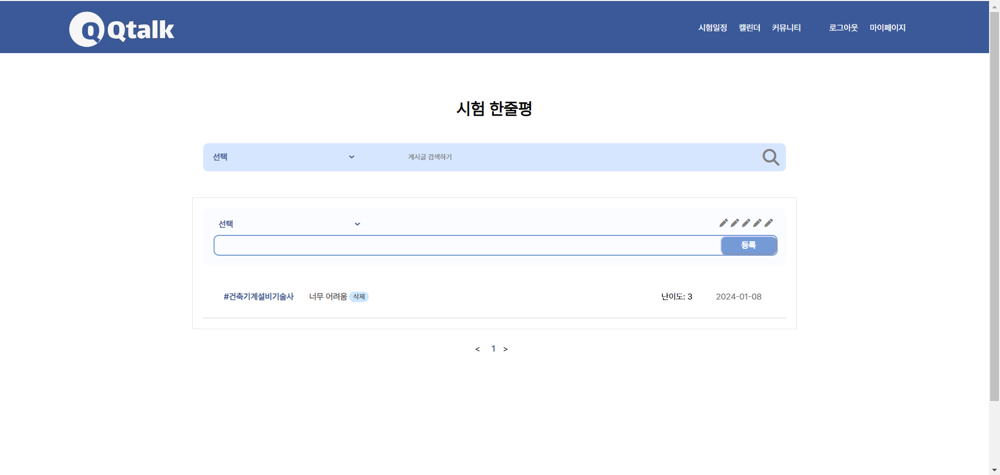

# Qtalk
국가 공인 자격증 시험 정보를 한 눈에 보여주고,  
사용자들 간 시험 후기 및 꿀팁을 공유할 수 있도록 하는 사이트

## 📑상세 설명

  
  
  

  
  

## 💻사용 기술 및 라이브러리
JSP, Javascript, JQuery, Ajax  
Java, Servlet, MyBatis, MariaDB 
CSS, HTML5 
Github

## 👩‍💻담당한 기능
- 전반적인 프론트
- 시험 문제 공유 게시판(시험명, 회차, 이미지 등) 작성, 수정, 상세페이지
- 자유게시판 작성, 수정, 상세페이지
- 시험 한줄평 게시판(난이도)
- 시험 일정 카테고리(대분류, 중분류, 소분류)

